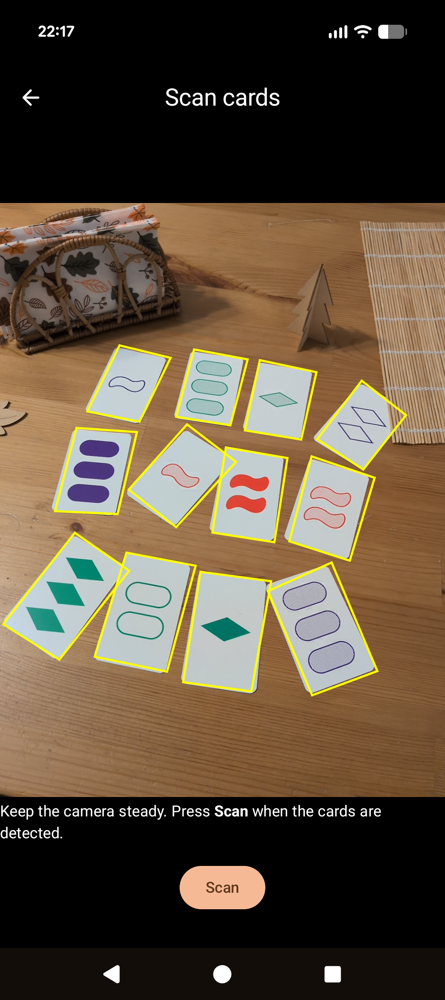
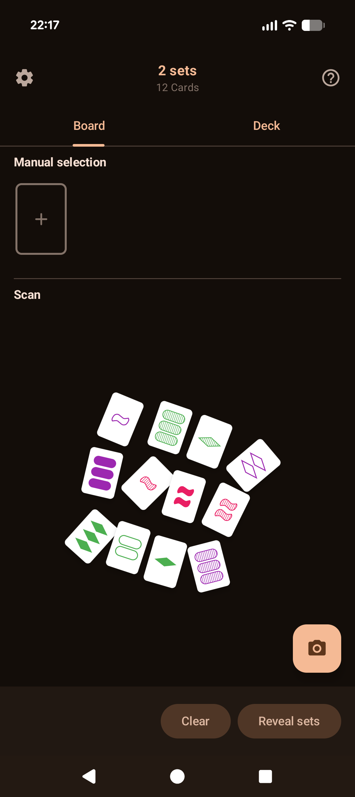
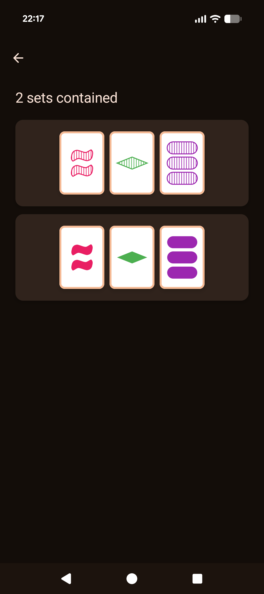

# Set Detect

Point your camera at a table of SET® cards and instantly see whether valid sets are contained.

  <video src="android-branding/screen-capture.mp4" autoplay loop muted playsinline height="300"></video>
  
  
  

## Disclaimer

Unofficial, fan-made project; not affiliated with, endorsed by, or sponsored by SET Enterprises, Inc.

## License

AGPL-3.0 (see [`LICENSE`](LICENSE)).
