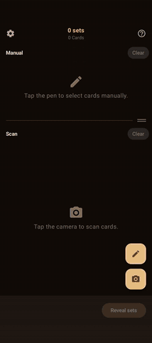
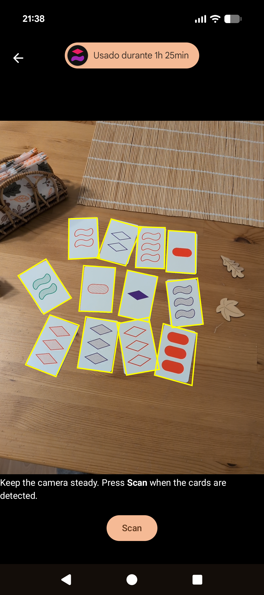
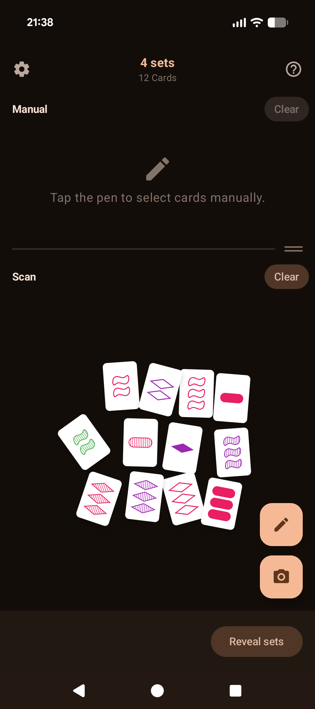
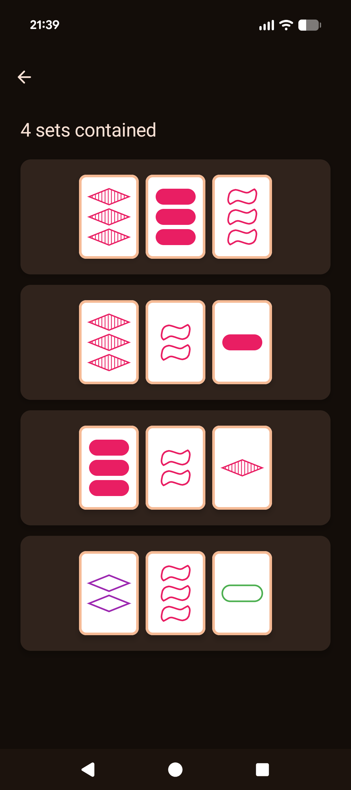

# Set Detect

Use your camera to see if a SET® is hiding among your cards. Reveal it on tap.

  
  
  
  

## Disclaimer

Unofficial, fan-made project; not affiliated with, endorsed by, or sponsored by SET Enterprises, Inc.

## License

AGPL-3.0 (see [`LICENSE`](LICENSE)).
