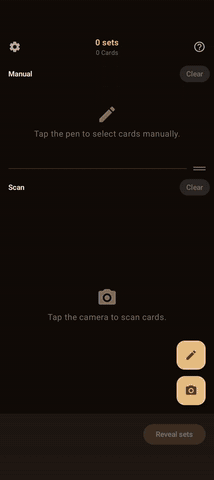
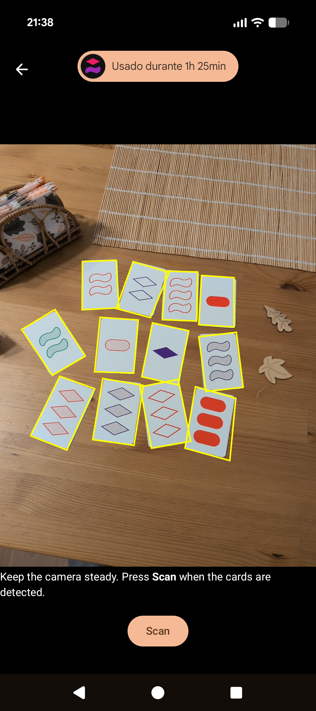
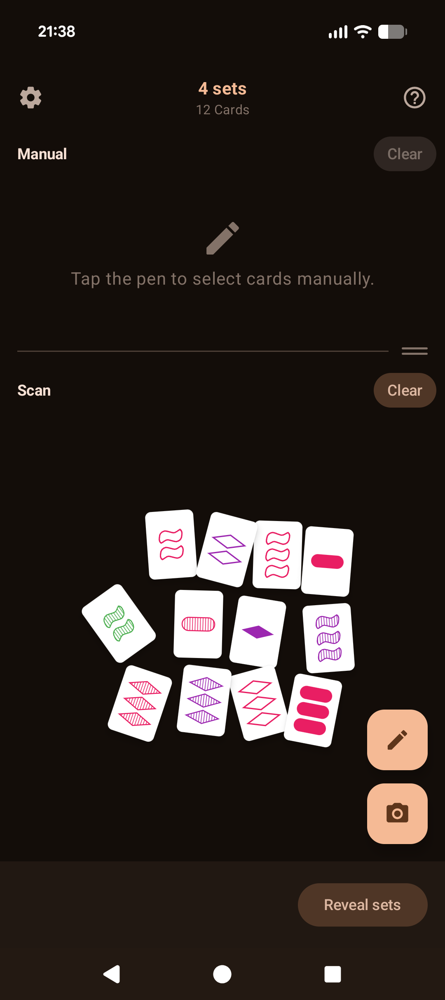
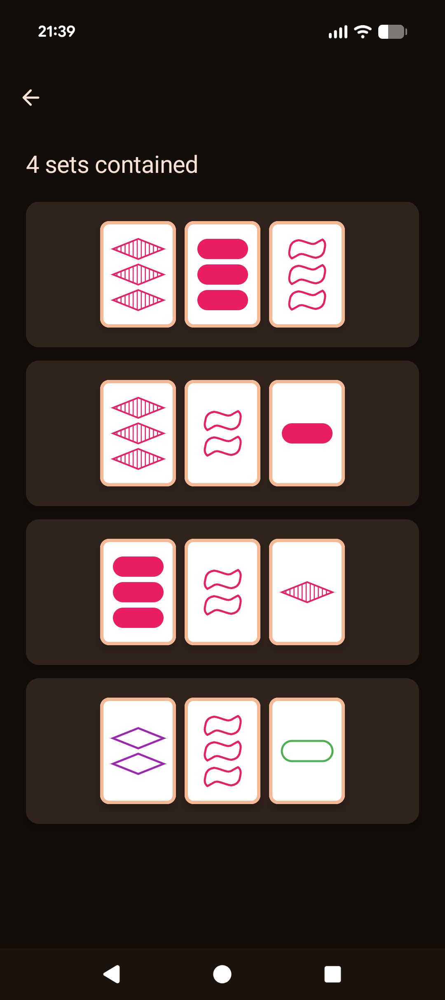

# Set Detect
This project constitutes an Android app that helps to find sets in the card game SET®.
The laid out card arrangement can be entered manually or scanned via the phone's camera.

<p>
  
  
  
  
</p>

This repository does not only contain the Android frontend and the C++ computer vision backend for card scanning. It also holds the Python framework for fast prototyping, for training the involved artificial neural networks, and for timing algorithms.

## Disclaimer
Unofficial, fan-made project; not affiliated with, endorsed by, or sponsored by SET Enterprises, Inc.

## Pre-trained models
The pre-trained models for card detection and classification via the phone's camera are available at https://github.com/levfa/set-detect-models.

## Python usage
The python project is located in [py/](py/).
* Install and activate (in `py/`): `uv sync` and `source .venv/bin/activate`
* Test (in `py/`): `pytest`
* Lint (in `py/`): `ruff check` and `ruff format --check`

### Example
The executable scripts are located in [py/src/setdetect/cli/](py/src/setdetect/cli/) and are installed as `set-...` aliases.
The models for card detection and classification can be trained and used as follows (from the repository root):

* Create cards:
  ```
  set-card-cutouts extract-cards \
    --data-root examples/data/img-real-card-cutouts
  ```
* Download and select background textures:
  ```
  set-backgrounds-data download \
    --local-dir examples/data/huggingface/nyuuzyou/texturecan
  ```
  ```
  set-backgrounds-data build-manifest \
    --local-dir examples/data/huggingface/nyuuzyou/texturecan
  ```
* Train and export the card corner detection:
  * Generate a validation data set:
    ```
    set-card-corners synth-gen \
      --data-root examples/data/img-synth-boards-corners \
      --cards-root examples/data/img-real-card-cutouts \
      --textures-root examples/data/huggingface/nyuuzyou/texturecan
    ```
  * Train:
    ```
    set-card-corners synth-train \
      --data-root examples/data/img-synth-boards-corners \
      --runs-root examples/models/set-card-corners/runs \
      --cards-root examples/data/img-real-card-cutouts \
      --textures-root examples/data/huggingface/nyuuzyou/texturecan \
      --models-root examples/models/ultralytics-cache
    ```
  * Make the latest training result the default:
    ```
    set-card-corners promote \
      --runs-root examples/models/set-card-corners/runs
    ```
  * Export:
    ```
    set-card-corners export \
      --runs-root examples/models/set-card-corners/runs
    ```
* Train and export the quantized card classifier:
  * Generate a validation and quantization data set:
    ```
    set-card-classification synth-gen \
      --data-root examples/data/img-synth-boards-class \
      --cards-root examples/data/img-real-card-cutouts \
      --tex-root examples/data/huggingface/nyuuzyou/texturecan
    ```
  * Train:
    ```
    set-card-classification train \
      --data-root examples/data/img-synth-boards-class \
      --runs-root examples/models/set-card-classification/runs \
      --cards-root examples/data/img-real-card-cutouts \
      --tex-root examples/data/huggingface/nyuuzyou/texturecan
    ```
  * Make the latest training result the default:
    ```
    set-card-classification promote \
      --runs-root examples/models/set-card-classification/runs
    ```
  * Export and quantize:
    ```
    set-card-classification export \
      --runs-root examples/models/set-card-classification/runs
    ```
    ```
    set-card-classification quantize \
      --data-root examples/data/img-synth-boards-class \
      --runs-root examples/models/set-card-classification/runs
    ```
* Detect, rectify, and classify cards in an image:
  ```
  set-card-detection show-arrangement \
    --data-root examples/data/img-real-card-cutouts \
    --det-corner-weights examples/models/set-card-corners/runs/current/onnx/card_corners.onnx \
    --det-class-weights examples/models/set-card-classification/runs/current/onnx/model_quantized.onnx
  ```

## C++ usage
The C++ implementation of the card detection and classification pipeline is located in [cpp/](cpp/).
It uses the ONNX-exports from the Python training pipeline.

* Prerequisites:
  * CMake
  * Ninja
  * VCPKG
  * ONNX runtime
  * cuDNN
  * OpenCV (can be installed via conda-forge)
  * pre-commit
  * The following environment variables must point to valid installations:
    * `VCPKG_ROOT`
    * `ONNXRUNTIME_ROOT`
    * `CUDNN_ROOT` (and `CUDNN_ROOT/lib` must be on `LD_LIBRARY_PATH`)
    * `OpenCV_ROOT`
* Build (in `cpp/`):
  ```
  ./configure
  ninja -C build
  ```
* Format (from the repository root): `pre-commit run clang-format --all-files`
* Code-quality check (from the repository root): `pre-commit run clang-tidy --all-files`
* Test (in `cpp/`): `ctest --test-dir build --output-on-failure`

## Android usage
The folder [android/](android/) can directly be opened as an Android Studio project.

## License
AGPL-3.0 (see [`LICENSE`](LICENSE)).
